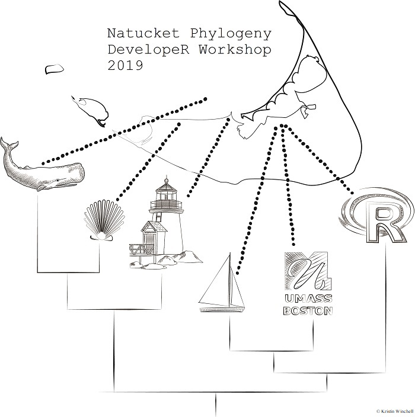

We are very happy to announce the 2nd edition of a graduate-level workshop on phylogenetic method development R. The course will be four days in length and take place at the University of Massachusetts Boston's Nantucket Field Station from the 5th to the 8th of November, 2019. The workshop is intended for (and open to) anyone from an evolutionary biologist with interest in phylogenetic methods and a little prior computer programming experience, to an intermediate or advanced computational biologist curious about honing their skills in R development for phylogenetics.

On the first 2.5 days of the workshop, course leaders Drs. April Wright, Josef Uyeda, Klaus Schliep, Claudia Solís-Lemus, & Liam Revell will provide an introduction to the primary data structures and methods of common phylogenetic R packages, the basics of computational algorithms for phylogenies, and an overview of other essential topics of software development in R (version control, unit testing, documentation, and R package development), the specific details of which will depend on the prior experience of the bootcamp participants. Over the subsequent 1.5 workshop days participants will work in break-out groups with workshop leaders to develop small R packages on their chosen topics. These projects will focus on adding new functionality to existing R software in phylogenetics, and might range from tree manipulation, to phylogenetic inference, to comparative methods, to phylogenetic simulations, to the visualization of phylogenies or macroevolutionary data on trees.

The workshop is funded by awards from the National Science Foundation to Dr. Liam Revell (NSF DEB-1350474 and DBI-1759940), with additional support from the University of Massachusetts Boston. All accepted students originating from a U.S. port of origin will have their travel costs covered or defrayed, and room and board during the workshop will be provided. As the workshop will be held at a field station, accommodation is comfortable, but basic, and participants should be prepared to stay in multiple occupancy rooms.

To apply for the course, please complete the following google form. Details of relevant programming background (computer languages, R knowledge, GitHub repositories, …) should also be provided. Admission is competitive, and preference will go towards students with background in evolutionary biology, basic to moderate experience in computer programming (ability to read a data file into R or a similar language and parse it for information, familiarity with iteration and functions, ability to identify when to use basic datatypes such as vectors and dataframes, and comfort with using help documentation to find answers), and a compelling motivation for taking the course. Applications should be submitted the google form by September 10, 2019. Questions can be directed to [klaus.schliep@umb.edu](mailto:klaus.schliep@umb.edu) or [liam.revell@umb.edu](mailto:liam.revell@umb.edu).

[Apply here](https://docs.google.com/forms/d/19vn0iJExxAPAEyDpGsEDj_HNW1-99cmcPa1UjvdA7XM/)

  
 

---

